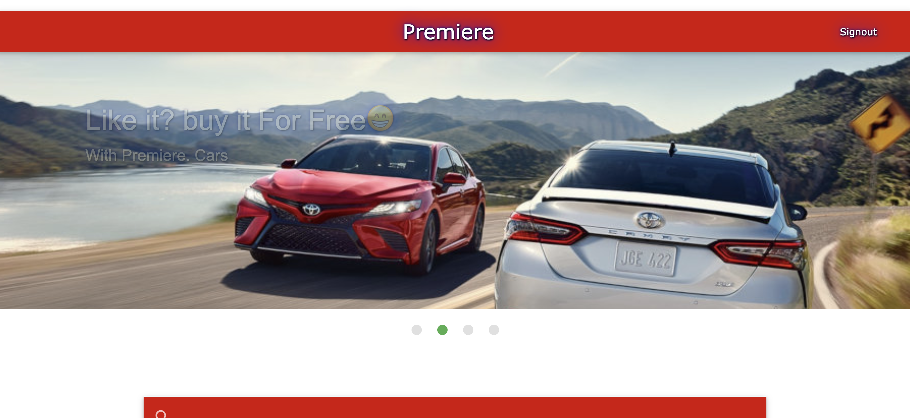
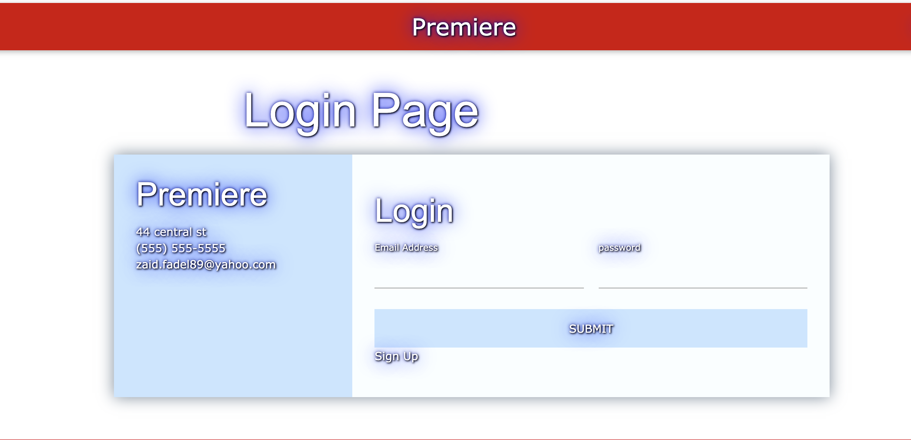
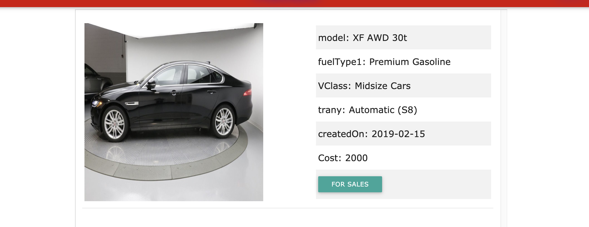
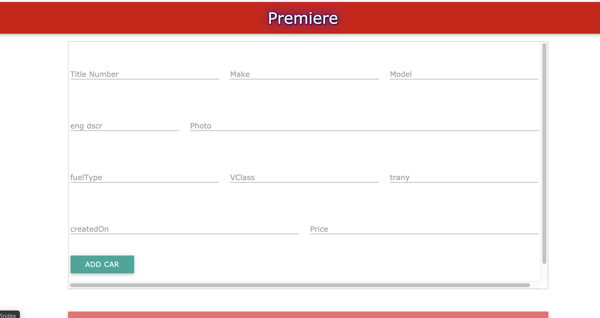

# newProject-2

Our project is about dealarship site. We name it as Premiere. It lets the shopper check the car they want. When click on it, it will show you car's describtion such as miles, color,kind,etc. Then, it will take them to another site when they can buy it.

[Live link](https://projectss2.herokuapp.com/login)

## Other Topics to Explore

Sell,buy, and rent on the same site.

## Technologies Used

- Node js
- Npm Express
- Npm Body-parser
- Npm Bcrypt
- Npm Handlebars
- Opendatasoft
- Materialize.css
- Jquery
- Npm Mailer

## Start

- Login Page
  
- Main Page
  
- describtion Page
  
- Dealer Page
  
